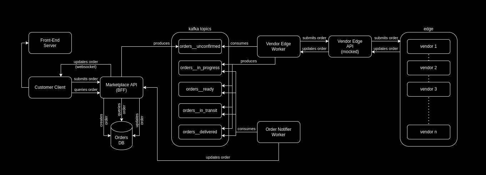

# Marketplace

My first journey into event-driven architectures 
this project aims to be a marketplace with high thoughput event streaming, 
It is solely focused on learning experience and is currently in it's very early stages 

The current objective is to deal with orders and to learn the ins and outs of Kafka 

## Architecture (AS-IS):

#### Customer Client

Creates orders, queries for orders, and displays live order status through websocket 
Does not query for vendors or products, it's all hardcoded for now 

#### Marketplace API

Creates, updates, and queries database for orders, publishes new orders to the kafka bus, writes all orders created and updated to the websocket endpoint 

#### Vendor Edge Worker

Subscribes to the new orders topic, submits new orders to the Vendor Edge API, publishes order status updates received from the Vendor Edge API to their respective topics 

#### Vendor Edge API

Receives new orders from the Vendor Edge Worker and mocks order status updates from vendors with random timeouts 
In the future it will have an endpoints facing the vendor client so that the vendors can see new orders and update their status 

#### Order Notifier Worker

Subscribes to all order topics that track status updates and calls the Marketplace API to update order statuses 

